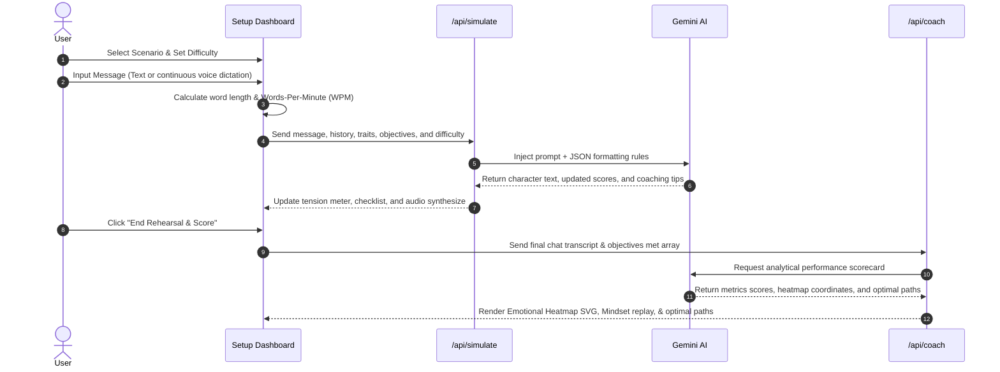
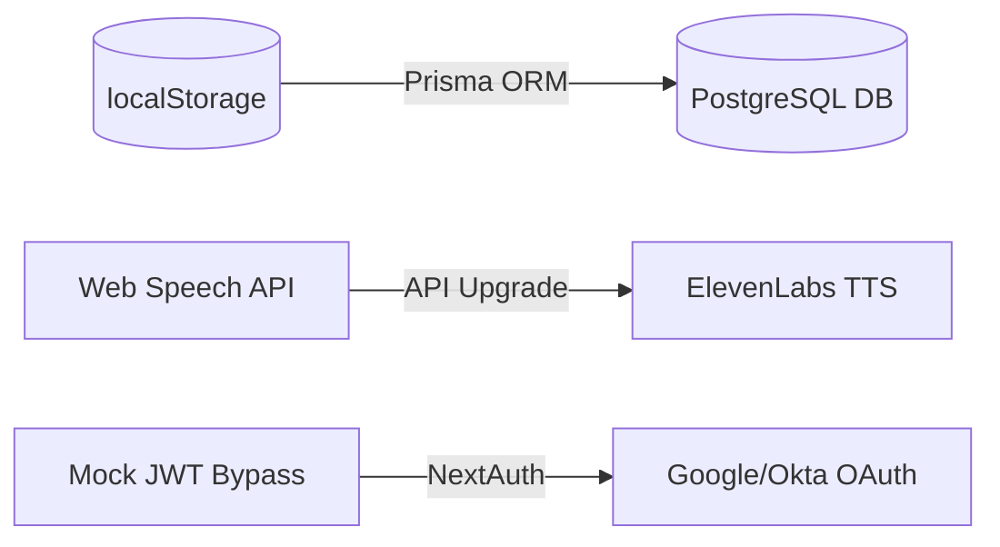

# EchoPersona V3 - Technical Documentation & System Architecture
*A Comprehensive Guide to the AI Flight Simulator for Hard Conversations.*

---

## 1. Problem Statement — What We're Solving

Interpersonal communication is the single most critical factor in professional success and personal wellness, yet it remains one of the hardest skills to develop. 
*   **The Avoidance Epidemic**: 73% of managers and professionals actively avoid difficult workplace confrontations, salary reviews, or setting personal boundaries (Harvard Business Review).
*   **Static Solutions**: Traditional training resources are passive (reading books/articles) or high-friction (roleplaying with colleagues/managers is awkward and socially vulnerable).
*   **Deficiencies in Generic AI**: Standard chat-assistants (like ChatGPT or Claude) provide generic advice ("stay calm") or converse in a linear, cooperative manner. They do not simulate emotional pushback, defensiveness, or hidden motivations, nor do they provide analytical metrics on vocal pacing, assertive posture, or conversational leverage.

**EchoPersona V3** solves this by building a true **Flight Simulator for Hard Conversations**. It provides a safe, private, state-driven sandbox where users can practice speaking under tension against customized counterparts. The application provides immediate, structured coaching feedback, allowing users to fork timelines, rewinds, and dissect exactly where they gained or lost leverage.

---

## 2. Architecture Diagram & Overview

The system is designed with a decoupled Next.js 16 frontend and api server router communicating with the Google Gemini API.

```
                  +-------------------------------------------------+
                  |                   User Browser                  |
                  |  +-------------------------------------------+  |
                  |  |                Tailwind UI                |  |
                  |  +---------------------+---------------------+  |
                  |                        |                        |
                  |            [Dictation/Playback Hooks]           |
                  |                        |                        |
                  |  +---------------------v---------------------+  |
                  |  |          Web Speech STT / TTS             |  |
                  |  +---------------------+---------------------+  |
                  +------------------------|------------------------+
                                           |
                                   [Next.js Router]
                                           |
                  +------------------------v------------------------+
                  |                 Next.js API Server              |
                  |  +-------------------------------------------+  |
                  |  |   /api/simulate      |    /api/coach      |  |
                  |  +---------+------------+----------+---------+  |
                  |            |                       |            |
                  +------------|-----------------------|------------+
                               |                       |
                               +-----------+-----------+
                                           |
                                [Official Gemini SDK]
                                           |
                  +------------------------v------------------------+
                  |                  AI Core Layer                  |
                  |  +-------------------------------------------+  |
                  |  |           Gemini-2.5-flash Model          |  |
                  |  +-------------------------------------------+  |
                  +-------------------------------------------------+
```

---

## 3. Tech Stack

*   **Frontend Core**: Next.js 16 (Turbopack compiler), React 19, TypeScript, Tailwind CSS v4.
*   **Styling & Icons**: Vanilla CSS tokens, Tailwind glassmorphism styles, Lucide React Icons.
*   **AI Orchestration**: Official `@google/generative-ai` SDK.
    *   **Model**: `gemini-2.5-flash` (chosen for sub-second text latency, native structured JSON output formatting, and cost efficiency).
*   **Audio Engines**:
    *   **Speech-to-Text (STT)**: Web Speech API `SpeechRecognition` (runs continuously client-side, calculates recording duration, and measures Words-Per-Minute).
    *   **Text-to-Speech (TTS)**: Web Speech API `SpeechSynthesis` (synthesizes roleplay replies in character).
*   **Data Persistence**:
    *   **Client-Side**: `localStorage` (seeds default scenarios, stores custom templates, archives timeline branches, and plots historic session scorecards).
    *   **Production-Ready Schema**: Relational database migration scripts designed for PostgreSQL.

---

## 4. How It Works — Solution Flow



### 4.1 Step 1: Configuration
The user selects a blueprint scenario template (or designs a custom counterpart using independent sliders for formality, verbosity, interruption, volatility, and starting tension). They choose a difficulty level (Cooperative, Realistic, Hostile) and toggle the Coaching Assistant.

### 4.2 Step 2: Active Rehearsal
As conversation moves, turn inputs are calculated for WPM. The backend API `/api/simulate` parses instructions, manages the state checklist, and evaluates if positive tactics (Validation, Empathy) or negative tactics (Deflect, Interrupt) were used. The character's tension updates and triggers TTS voice playback.

### 4.3 Step 3: Performance Scorecard
Upon ending, the `/api/coach` API runs a structured assessment. It returns:
*   Scores from 0-100 on Assertiveness, Empathy, and Clarity.
*   An interactive SVG emotional timeline tracking trust and defensiveness spikes.
*   Optimal path reconstructions showing alternative responses.
*   A turn thought reveal mapping the AI's internal reasoning.

---

## 5. Scalability Plan

To transition EchoPersona from a local hackathon prototype to an enterprise SaaS product, we will follow this roadmap:



1.  **Storage Layer**: Replace `localStorage` with a PostgreSQL database managed via Prisma ORM. This allows saving history and custom presets across devices, yielding multi-tenant corporate databases.
2.  **Authentication**: Transition from the mock Google Sign-In bypass to production-grade NextAuth.js configurations, supporting federated single sign-on (SSO) for corporate compliance.
3.  **Premium Audio**: Upgrade standard browser-dependent Web Speech Synthesis to high-fidelity, low-latency ElevenLabs API streaming to provide human-like accents and emotional ranges.
4.  **Team Dashboards**: Deploy workspace metric pages, allowing corporate HR directors to analyze aggregate communication progress, WPM averages, and certification milestones for entire departments.

---

## 6. Challenges Faced & Resolved

### 6.1 Hackathon Judge Authentication Blockers
*   **The Challenge**: Integrating live Google OAuth requires the user/judge to configure domain scopes and Client IDs in the Google Cloud Console. This creates massive friction during hackathon grading.
*   **The Solution**: We implemented a **Demo Sign-In Bypass** widget. Tapping this button generates a mock base64 JWT payload matching the Google Identity schema. The client decodes it exactly like the live auth track, providing a zero-setup preview.

### 6.2 Preventing AI "Hallucinations" in Real-Time Coaching Tips
*   **The Challenge**: Getting the AI to evaluate the user's latest statement and check off objectives without leaking system rules or generating generic text.
*   **The Solution**: We enforced **strict JSON mode configurations** (`responseMimeType: 'application/json'`) on `gemini-2.5-flash`. The prompt forces the model to return a structured payload enclosing separate fields for the character reply, the private coaching note, and the objective completion array.

### 6.3 Local Storage Schema Evolution
*   **The Challenge**: Adding new presets or updating scenario objectives caused browser crashes for returning users because their cached `localStorage` datasets had outdated shapes.
*   **The Solution**: We built an array length validation mechanism inside `page.tsx`'s loading hook. If the browser cache size differs from `DEFAULT_PRESETS` or holds fewer objectives, the system automatically invalidates and refreshes the database structure transparently.
